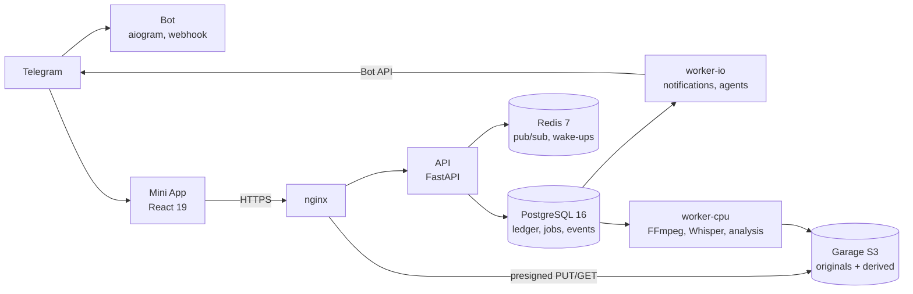

<div align="center">

# SynthCut

**AI-driven professional video post-production OS, run from a Telegram Mini App.**

RAW / Log footage → analysis → speech → intelligent editing → color → audio → motion → captions → QA → render


[Architecture](docs/ARCHITECTURE.md) · [Project map](docs/SITEMAP.md) · [Data model](docs/ERD.md) · [Decisions](docs/adr/) · [API](docs/openapi.json) · [Changelog](CHANGELOG.md)

</div>

---

## What it is

SynthCut takes multi-gigabyte footage straight from a phone, understands it — metadata, colour, shots, faces, speech — and turns it into an edit through a team of specialist AI agents (Director, Editor, Color, Audio, Motion, Caption, QA). Everything is driven from a Telegram Mini App; heavy work runs in background workers on the server.

The core rule: **AI decides, deterministic media engines execute.** Agents never run commands or touch files — they call typed tools that enqueue FFmpeg / Whisper / Remotion jobs, and every decision is stored as a versioned, validated `EditPlan`.

## Highlights

| Area | What works today |
|---|---|
| **Upload** | Resumable S3 multipart uploads up to 50 GB straight to object storage; MD5-bound presigned parts; pause, resume on another device, live progress |
| **Media engine** | ffprobe → versioned `mediainfo/1`; colour detection (Rec.709, Display P3, Rec.2020, HLG, PQ, Apple Log); one decode pass for a 720p proxy, scene cuts, 16 kHz speech track and EBU R128 loudness; HDR tone-mapping; filmstrip and posters |
| **Speech** | Local Whisper (`large-v3-turbo`, int8 CPU) behind a provider route; word timings, segments, questions, silences; WebVTT / SRT subtitles; Uzbek detection fix and Uzbek-Latin normalisation |
| **Motion graphics** | Remotion overlay layer: 15 registry widgets, 4 animated caption styles with safe zones, synthesised SFX; FFmpeg composites; captioned MP4 from any clip |
| **Shot analysis** | Per shot: shot type and people from YuNet faces, camera motion (static / pan / tilt / handheld), sharpness, exposure, speech share, retakes (perceptual hash), usability score and editor-language flags |
| **Mini App** | Projects, live pipeline (SSE), uploads, asset pages with proxy player + subtitle track, tappable transcript, shot cards, Analysis and Transcript tabs |
| **Operations** | Postgres-leased job queue with leases, heartbeats, retries and idempotency; release-per-commit deploys with automatic rollback; server-side test stack on real PostgreSQL / Redis / Garage |

## Architecture



* **API** — FastAPI, SQLAlchemy 2 (async), Pydantic contracts exported as OpenAPI; the Mini App's TypeScript types are generated from it.
* **Workers** — one image, queues `io` / `cpu` / `gpu` / `render` / `llm`; jobs are rows in PostgreSQL (`FOR UPDATE SKIP LOCKED`), Redis only rings the bell.
* **Storage** — originals are immutable; derived files live under deterministic keys, so re-running a job overwrites instead of duplicating.
* **Agents** — own agent loop with a permission gate per tool, step and cost limits, and a provider-neutral model router (`provider:model` per role).

Details: [docs/ARCHITECTURE.md](docs/ARCHITECTURE.md) and twelve [architecture decision records](docs/adr/).

## Roadmap

| Phase | Scope | Status |
|---|---|---|
| 0 | Architecture, ERD, API contract, queue, storage, events, agent interfaces, timeline schema | ✅ done |
| 1 | FastAPI, PostgreSQL, Redis, object storage, Telegram auth, Mini App, projects | ✅ done |
| 2 | Resumable multipart upload, progress, pause/resume, checksums | ✅ done |
| 3 | FFprobe, proxies, thumbnails, audio extraction, shot detection, colour metadata | ✅ done |
| 4 | Whisper, word timestamps, silences, subtitles | ✅ done |
| 5 | Video intelligence — measured shot analysis (5a) · vision descriptions (5b) | 🟡 5a done |
| 6 | Master, Director and Editor agents, EditPlan persistence | ⏳ next (needs model key) |
| 7 | Remotion compositions, widget registry, animated captions, SFX | ✅ engine done |
| 8 | Color and Audio agents: grading, Log → Rec.709, mixing, ducking | ⏳ planned |
| 9 | QA, error classifier, reflection, retries | ⏳ planned |
| 10 | Memory, preferences, feedback | ⏳ planned |
| 11 | Full render from originals | ⏳ planned |
| 12 | Telegram delivery | ⏳ planned |

## Tech stack

| Layer | Technology |
|---|---|
| Backend | Python 3.12, FastAPI, SQLAlchemy 2.1 (psycopg 3), Alembic, Pydantic 2, uv workspace |
| Workers | PostgreSQL-leased job queue, Redis 7 pub/sub |
| Media | FFmpeg 7.1 / ffprobe, zscale tone-mapping, OpenCV (YuNet), NumPy |
| Speech | faster-whisper (CTranslate2), Silero VAD |
| Storage | Garage v2 (S3-compatible), presigned multipart |
| Frontend | React 19, Vite 7, Tailwind CSS 4, TanStack Query, openapi-fetch, Telegram WebApp SDK |
| Motion | Remotion 4 (React), Chrome Headless Shell, ProRes 4444 layers, Montserrat / Inter (OFL) |
| Bot | aiogram 3 (webhook only) |
| Infrastructure | Docker Compose, nginx, Let's Encrypt, release directories with rollback |
| Quality | pytest (unit + integration on real services), Vitest, Ruff, TypeScript strict, GitHub Actions |

## Repository layout

```
apps/
  api/          FastAPI service (auth, projects, uploads, assets, events/SSE)
  worker/       background jobs: ingestion, speech, analysis, delivery, maintenance
  bot/          Telegram bot (webhook): /start /new /projects /status
  mini-app/     React Telegram Mini App
  remotion/     motion graphics: registry widgets, captions, overlay render
packages/
  schemas/      shared contracts: API DTOs, events, jobs, mediainfo/1, transcript/1, clipanalysis/1
  core/         settings, database, models, migrations, queue, events, stages
  storage/      S3 key layout, immutability guard, multipart, presigning
  media-engine/ ffprobe normalisation, colour detection, FFmpeg plans and runner
  speech/       speech engines, silences, subtitle cues
  analysis/     shot measurements, faces, scores
  model-router/ provider-neutral model routing and pricing
  agent-sdk/    agent specs, typed tools, permission gate, agent loop
  timeline/     EditPlan schema, validation, versioning
agents/         the 13 agent manifests and the tool catalog
infrastructure/ Dockerfiles, nginx, Garage, deployment scripts
docs/           architecture, ERD, ADRs, OpenAPI, project map
tests/          unit, integration (real PostgreSQL/Redis/S3), e2e (deployed Mini App)
```

A full map of screens, endpoints, jobs, storage keys and stages: **[docs/SITEMAP.md](docs/SITEMAP.md)**.

## Getting started

**Requirements:** Python 3.12 with [uv](https://docs.astral.sh/uv/), Node.js 22, FFmpeg 7, PostgreSQL 15+ and Redis 7 (for integration tests).

```bash
make sync          # install the Python workspace
make test-unit     # unit tests (no services) + Mini App tests
make test          # + integration tests: local PostgreSQL + Redis, S3 via moto
make lint          # ruff + TypeScript
make openapi       # regenerate OpenAPI and the Mini App types after API changes
make web-dev       # Mini App on :5173, /api proxied to :3400
```

Integration tests drop and recreate the schema of `SYNTHCUT_TEST_DATABASE_URL` — never point it at a real database.

Configuration lives in environment variables; every one is documented in [`.env.example`](.env.example). In production the file is generated once by `infrastructure/deployment/bootstrap.sh` and never committed.

## Deployment

```bash
bash infrastructure/deployment/deploy.sh   # ships the committed HEAD
```

Each commit becomes a release directory and an image tag on the server: build → nginx + TLS → storage init → speech model fetch → migrate → start → health check → automatic rollback to the previous release if unhealthy. Migrations are additive only, so an image rollback never needs a schema downgrade. The server-side test stack (`infrastructure/deployment/test-stack.sh`) runs the full suite against throwaway PostgreSQL, Redis and Garage containers.

## Security

Private by design: access is limited to an allowlist of Telegram users (fails closed), Telegram `initData` is HMAC-verified, sessions are short-lived signed tokens, uploads are checksum-bound, and every query is owner-scoped. See [SECURITY.md](SECURITY.md) for how to report a vulnerability.

## Developer

**Omonjon** — full-stack developer, 4+ years of experience · founder of [BlueCore Dev](https://github.com/bluecore-dev) IT agency · design, architecture and development of SynthCut

| | |
|---|---|
| Phone | [+998 91 911 99 88](tel:+998919119988) |
| Website | [socialmarketing.uz](https://socialmarketing.uz) |
| Telegram | [@anvarov_911](https://t.me/anvarov_911) |
| Email | [anvarov1170@gmail.com](mailto:anvarov1170@gmail.com) |
| GitHub | [@bluecore-dev](https://github.com/bluecore-dev) |

## License

Proprietary — © 2026 Omonjon. All rights reserved. See [LICENSE](LICENSE).

---

### O'zbekcha qisqacha

**SynthCut** — telefondan yuklangan katta hajmdagi videolarni avtomatik tahlil qiladigan (metadata, rang, kadrlar, yuzlar, nutq) va AI agentlar jamoasi yordamida professional montajga aylantiradigan tizim. Boshqaruv Telegram Mini App orqali, og'ir ishlar serverdagi fon ishchilarida bajariladi. Hozir 0–5a va 7 bosqichlar tayyor: rezyumli yuklash, media tahlili, nutqni matnga o'girish va subtitrlar, kadrlar tahlili, Remotion motion grafika va animatsion subtitrli video. Keyingi bosqich — Director va Editor agentlari.

**Dasturchi:** Omonjon — 4+ yillik tajribaga ega full-stack dasturchi · [+998 91 911 99 88](tel:+998919119988) · [socialmarketing.uz](https://socialmarketing.uz) · Telegram [@anvarov_911](https://t.me/anvarov_911)
