# SynthCut — Entity relationships

Implemented in migrations `0001_foundation` (Phase 1–2), `0002_ingestion` (Phase 3), `0003_transcripts` (Phase 4), `0004_clip_analyses` (Phase 5) `0005_edit_plans_renders` (Tez montaj, render, QA, delivery — ADR-0015) and `0006_preferences_feedback` (memory — ADR-0016):

```mermaid
erDiagram
    users ||--o{ projects : owns
    users ||--o{ upload_sessions : starts
    projects ||--o{ project_stages : "pipeline (13 rows)"
    projects ||--o{ assets : contains
    projects ||--o{ jobs : scopes
    projects ||--o{ events : logs
    assets ||--o| upload_sessions : "uploaded by"
    assets ||--o{ media_files : "derived files"
    assets ||--o| transcripts : "speech"
    assets ||--o| asset_analyses : "shot analysis"
    assets ||--o{ clip_analyses : "one per shot"
    projects ||--o{ edit_plans : "versions"
    edit_plans ||--o{ renders : "rendered as"
    users ||--o{ preferences : "remembers"
    renders ||--o{ feedback : "about"
    feedback ||--o{ preferences : "set by"
    jobs ||--o{ jobs : "parent_id"

    users {
        uuid id PK
        bigint telegram_id UK
        text username
        bool is_active
        timestamptz last_seen_at
    }
    projects {
        uuid id PK
        uuid owner_id FK
        text name "1..120"
        text preset "reels_9x16 | youtube_16x9_1080 | ..."
        smallint fps
        int target_duration_sec
        text mode "auto | assisted | manual"
        text language
        text brief
        text status "active | archived"
    }
    project_stages {
        uuid project_id PK
        text stage PK "upload ... delivery"
        text status "pending | queued | running | done | failed | ..."
        real progress "0..1"
        text detail
    }
    assets {
        uuid id PK
        uuid project_id FK
        text kind "video | audio | image | other"
        text status "uploading | uploaded | ingesting | ready | failed | cancelled"
        text storage_key UK "projects/<p>/originals/<a>/source.<ext>"
        bigint size_bytes
        text fingerprint "unique while uploading"
        text etag "S3 composite"
        text sha256 "of the original"
        jsonb media_info "MediaInfo mediainfo/1"
        text color_profile "rec709 | hlg | pq | apple_log | ..."
        text video_codec
        bool has_audio
    }
    media_files {
        uuid id PK
        uuid asset_id FK
        text kind "proxy_720p | poster | sprite | audio_speech | audio_proxy | preview | shots | mediainfo | transcript | subtitles_vtt | subtitles_srt | clips | caption_preview"
        text storage_key UK "projects/<p>/<area>/<a>/<name>"
        bigint size_bytes
        jsonb metadata "tiles, interval, shots, tonemapped..."
    }
    transcripts {
        uuid id PK
        uuid asset_id FK,UK
        text status "queued | running | done | failed"
        text requested_language "auto | uz | ru | en"
        text language "detected or forced"
        text engine "provider:model"
        int word_count
        real speech_sec
        jsonb data "transcript/1: words, segments, silences, cues"
        int runs "bumped per request (idempotency key)"
    }
    asset_analyses {
        uuid id PK
        uuid asset_id FK,UK
        text status "queued | running | done | failed"
        text source "metrics | metrics+vision"
        int clip_count
        real usable_avg
        int runs
    }
    clip_analyses {
        uuid id PK
        uuid asset_id FK
        text clip_id "<asset prefix>-sNNN"
        int shot_index "UK with asset_id"
        real start_sec
        real end_sec
        text shot_type
        text camera_motion
        real usable_score
        jsonb flags
        text dhash "64-bit, duplicate search"
        text sheet_key
        jsonb data "clipanalysis/1"
    }
    edit_plans {
        uuid id PK
        uuid project_id FK
        int version "UK with project_id, append-only"
        text source "rules | director | user"
        jsonb plan "editplan/1"
        real duration_sec
        int clip_count
        text notes
        jsonb options "what was asked for"
    }
    renders {
        uuid id PK
        uuid plan_id FK
        int plan_version "UK with project_id, preset, kind"
        text preset
        text kind "final"
        text status "queued | running | done | failed"
        text output_key
        text telegram_key "chat-sized copy, only over 50 MB"
        jsonb qa "qa/1"
        text qa_status "pass | warn | fail"
        bool deliver
        text delivery_status "none | queued | sent | failed"
        bigint telegram_message_id
    }
    preferences {
        uuid id PK
        uuid user_id FK
        uuid project_id FK "NULL = user scope (UK user_id, key)"
        text key "EditDefaults field"
        jsonb value
        text source "choice | feedback | agent"
        uuid feedback_id FK
    }
    feedback {
        uuid id PK
        uuid project_id FK
        uuid render_id FK
        int plan_version
        jsonb codes "quick corrections"
        text comment "for the Memory agent"
        jsonb changes "explained preference changes"
    }
    upload_sessions {
        uuid id PK
        uuid asset_id FK,UK
        text s3_upload_id
        bigint part_size
        int part_count
        text status "active | completing | completed | aborted | expired | failed"
        bigint bytes_reported
        timestamptz last_activity_at
    }
    jobs {
        uuid id PK
        text kind
        text queue "io | cpu | gpu | render | llm"
        smallint priority "0..3"
        text status "queued | running | succeeded | dead | cancelled"
        text idempotency_key UK
        jsonb payload
        int attempts
        text lease_owner
        timestamptz lease_expires_at
    }
    events {
        bigint id PK "SSE id"
        uuid project_id FK
        text type
        text level
        text message
        jsonb data
    }
```

## Planned (designed now, migrated in their phase)

| Table | Phase | Key columns |
|---|---|---|
| `edit_plans` additions | 6 | parent_version, reason, validation report — when agents and the user branch versions |
| `agent_runs` | 5–6 | project_id, job_id, agent, model, status, steps, tokens in/out/cache, cost_usd, transcript ref |
| `cost_records` | 5 | project_id, agent_run_id, provider, model, usage, cost_usd — the §33 dashboard sums these |
| `qa_reports` | 9 | plan-level findings, classification, deterministic_fix, attempts (≤ 3) — the reflection loop; the file's QA is `renders.qa` |
| `feedback` | 10 | project_id, user_id, text, target ref, structured interpretation |
| `memories` | 10 | global / session scopes and free-form agent memories beyond `preferences` |
| `research_documents` | 10 | source url, extract, verification status, embedding ref |
| `deliveries` | 12 | per-recipient history when a render is sent to more than the owner (today: `renders.delivery_*`) |
