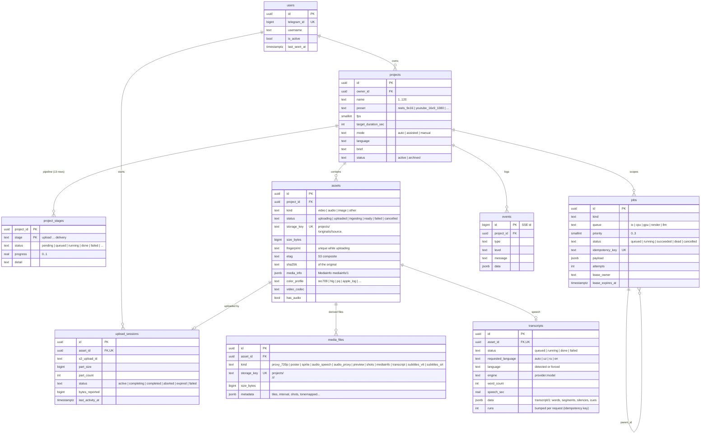

# SynthCut — Entity relationships

Implemented in migrations `0001_foundation` (Phase 1–2), `0002_ingestion` (Phase 3) and `0003_transcripts` (Phase 4):

## Planned (designed now, migrated in their phase)

| Table | Phase | Key columns |
|---|---|---|
| `media_analysis` | 5 | asset_id, clip ranges, shot_type, subject, framing, motion, quality scores, semantic_description, usable_score, model, cost |
| `timeline_versions` | 6 | project_id, version (UNIQUE per project), parent_version, created_by (agent/user), reason |
| `edit_plans` | 6 | timeline_version_id, schema_version, plan JSONB (EditPlan), validation report |
| `agent_runs` | 5–6 | project_id, job_id, agent, model, status, steps, tokens in/out/cache, cost_usd, transcript ref |
| `cost_records` | 5 | project_id, agent_run_id, provider, model, usage, cost_usd — the §33 dashboard sums these |
| `renders` / `render_versions` | 11 | timeline_version_id, preset, kind (preview/final), status, storage_key, probe report — UNIQUE(timeline_version_id, preset, kind) so a job can never render twice |
| `qa_reports` | 9 | render/plan ref, findings JSONB, classification, deterministic_fix, attempts (≤ 3) |
| `feedback` | 10 | project_id, user_id, text, target ref, structured interpretation |
| `memories` / `preferences` | 10 | scope (global/user/project/session), key (e.g. `transition_density`), value, source feedback |
| `research_documents` | 10 | source url, extract, verification status, embedding ref |
| `deliveries` | 12 | render_id, chat_id, transport (bot / link), telegram message id, status |
