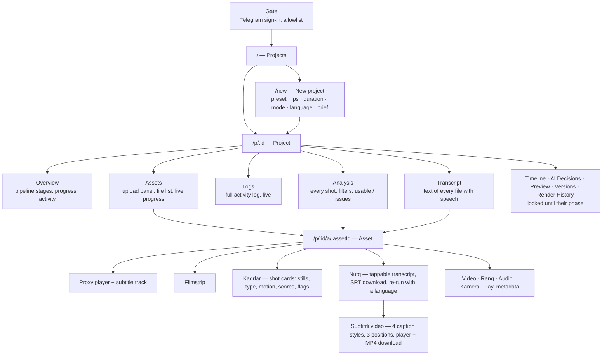

# SynthCut — project map

Where everything is: the screens a user sees, the endpoints behind them, the
background jobs, the storage layout and the pipeline stages. For *why* things
are built this way, read [ARCHITECTURE.md](ARCHITECTURE.md) and the
[ADRs](adr/).

## 1. Mini App screens



| Route | Screen | Data |
|---|---|---|
| — | Gate (sign-in, access denied, not in Telegram) | `POST /auth/telegram` |
| `/` | Projects list, storage usage | `GET /projects`, `GET /me` |
| `/new` | New project form | `GET /presets`, `POST /projects` |
| `/p/:id?tab=overview` | Pipeline stages, overall progress, recent activity | `GET /projects/{id}`, SSE |
| `/p/:id?tab=assets` | Upload panel and file list | `GET /projects/{id}/assets`, upload endpoints |
| `/p/:id?tab=logs` | Activity log | `GET /projects/{id}/events`, SSE |
| `/p/:id?tab=analysis` | All analysed shots of the project | `GET /projects/{id}/clips` |
| `/p/:id?tab=transcript` | Transcripts of every file | `GET /assets/{id}/transcript` |
| `/p/:id/a/:assetId[?t=sec]` | One file: player, shots, transcript, metadata | `GET /assets/{id}`, `/clips`, `/transcript` |

Deep link: the bot's "📂 Loyihani ochish" button opens `?p=<project id>`.

## 2. Telegram bot

| Command | Does |
|---|---|
| `/start` | Opens the Mini App (menu button is set on start-up) |
| `/new <name>` | Creates a project |
| `/projects` | Lists projects with a button each |
| `/status` | State of the latest project |
| `/help` | Help |

Webhook only (`/telegram/webhook/<hash of the secret>` plus the secret header); notifications are sent by
`worker-io` through the Bot API.

## 3. API (`/api/v1`)

| Group | Endpoints |
|---|---|
| Health | `GET /health`, `GET /ready` |
| Auth | `POST /auth/telegram`, `POST /auth/refresh`, `GET /me` |
| Projects | `GET/POST /projects`, `GET/PATCH /projects/{id}`, `POST /projects/{id}/archive`, `GET /presets` |
| Uploads | `POST /projects/{id}/uploads`, `GET/DELETE /uploads/{sid}`, `POST /uploads/{sid}/parts`, `POST /uploads/{sid}/progress`, `POST /uploads/{sid}/complete` |
| Assets | `GET /projects/{id}/assets`, `GET /assets/{id}`, `POST /assets/{id}/reingest` |
| Speech | `GET /assets/{id}/transcript`, `POST /assets/{id}/transcribe` |
| Analysis | `GET /assets/{id}/clips`, `GET /projects/{id}/clips`, `POST /assets/{id}/analyze` |
| Motion | `POST /assets/{id}/caption-preview` (state in `GET /assets/{id}` → `caption_preview`) |
| Activity | `GET /projects/{id}/jobs`, `GET /projects/{id}/events`, `GET /projects/{id}/events/stream` (SSE) |

Full contract: [openapi.json](openapi.json). Another user's object is always a 404.

## 4. Background jobs

| Kind | Queue | Priority | Queued by | Produces |
|---|---|---|---|---|
| `ingest.asset` | cpu | high | upload complete, re-ingest | `mediainfo/1`, proxy, posters, filmstrip, speech track, shots |
| `analysis.asset` | cpu | normal | ingestion (video) | `clipanalysis/1` per shot, shot sheets |
| `speech.transcribe` | cpu | low | ingestion (audio present) | `transcript/1`, VTT, SRT |
| `render.caption_preview` | render | high | the user (asset page) | `overlay/1` → Remotion ProRes 4444 layer → `captions.mp4` |
| `notify.telegram` | io | high | stage turns done | a Telegram message |
| `maintenance.expire_uploads` | io | low | scheduler | expired upload sessions closed |
| `maintenance.sweep_orphan_uploads` | io | low | scheduler | orphaned multipart uploads aborted |
| `maintenance.prune_jobs` | io | low | scheduler | old system jobs removed |

Workers: `worker-cpu` (media image with Node + Remotion + headless Chrome;
queues `cpu,render`, concurrency 1, 2 CPUs / 3 GB) and `worker-io` (queues
`io,llm`, scheduler). Planned queue: `gpu`.

## 5. Storage layout

```
projects/<project>/originals/<asset>/source.<ext>     immutable original
projects/<project>/proxies/<asset>/proxy_720p.mp4
projects/<project>/audio/<asset>/speech_16k.flac | audio_proxy.m4a
projects/<project>/thumbnails/<asset>/poster.jpg | sprite.jpg | preview.jpg
projects/<project>/analysis/<asset>/mediainfo.json | shots.json | clips.json
projects/<project>/analysis/<asset>/shot_NNN.jpg               one sheet per shot
projects/<project>/analysis/<asset>/transcript.json | subtitles.vtt | subtitles.srt
projects/<project>/previews/<asset>/captions.mp4               caption preview (Phase 7)
```

Reserved areas for later phases: `timeline/`, `renders/`, `exports/`.

## 6. Pipeline stages

| # | Stage | Phase | Becomes `done` when |
|---|---|---|---|
| 1 | Upload | 2 | every file is in storage |
| 2 | Media Ingest | 3 | every file is ingested |
| 3 | Media Analysis | 5 | every video's shots are analysed (`skipped` without video) |
| 4 | Transcription | 4 | every file with audio is transcribed (`skipped` without audio) |
| 5 | Director | 6 | — |
| 6 | Editor | 6 | — |
| 7 | Color | 8 | — |
| 8 | Audio | 8 | — |
| 9 | Motion | 7 | — |
| 10 | Captions | 7 | — |
| 11 | QA | 9 | — |
| 12 | Render | 11 | — |
| 13 | Delivery | 12 | — |

## 7. Data contracts

| Contract | Module | Stored in |
|---|---|---|
| `mediainfo/1` | `synthcut_schemas.media` | `assets.media_info`, `mediainfo.json` |
| `transcript/1` | `synthcut_schemas.speech` | `transcripts.data`, `transcript.json` |
| `clipanalysis/1` | `synthcut_schemas.analysis` | `clip_analyses.data`, `clips.json` |
| `overlay/1` | `synthcut_timeline.overlay` | render scratch (`overlay.json`) |
| `EditPlan v1` | `synthcut_timeline` | Phase 6 |

## 8. Documentation

| Document | Contents |
|---|---|
| [ARCHITECTURE.md](ARCHITECTURE.md) | The canonical design: deployment, components, upload, ingestion, speech, analysis, queue, events, agents, timeline, security, phases, operations |
| [ERD.md](ERD.md) | Tables and relations, planned tables |
| [adr/](adr/) | 12 decision records (why → impact → alternatives → decision) |
| [openapi.json](openapi.json) | Generated API contract |
| [../CHANGELOG.md](../CHANGELOG.md) | What changed, phase by phase |
| [../SECURITY.md](../SECURITY.md) | Reporting a vulnerability, security model |
